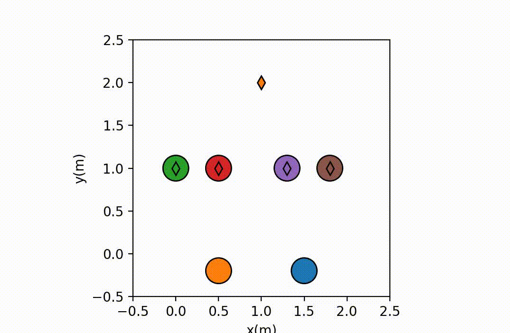
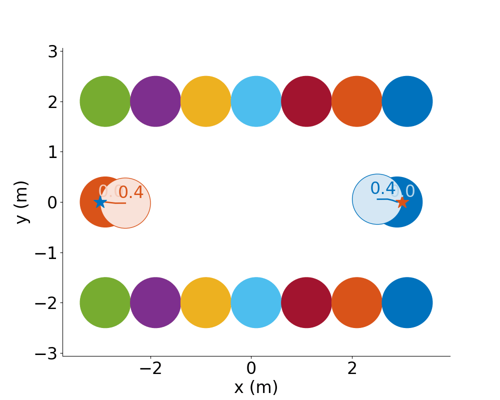

    
    
    

# Multi Agent Social Deadlock Avodidance (MASDA)
The Multi Agent Social Deadlock Avoidance (MASDA) repository is a comprehensive collection of algorithms and methodologies aimed at addressing the critical challenge of deadlock avoidance in multi-agent social navigation scenarios. In crowded environments such as doorways, hallways, and intersections, ensuring smooth and efficient movement of individuals or autonomous agents is paramount. The MASDA project focuses on providing solutions to mitigate and prevent the occurrence of deadlocks, enhancing the overall safety and functionality of these scenarios.

# About
* Multi Agent Navigation
* Deadlock Avoidance
* Social Navigation

# Table of Contents
- [**About**](#About)

# Supporterd Scenarios
Our repository covers a wide spectrum of social navigation scenarios, including but not limited to:

* Doorway Navigation: Efficient passage through doorways, especially in crowded settings, is a common challenge. We offer strategies to prevent congestion and deadlocks at entrances and exits.

* Hallway Navigation: Managing traffic flow in narrow hallways is critical for safe and efficient movement. Our algorithms focus on optimizing hallway traversal.

* Intersection Management: Intersections, whether for pedestrians, vehicles, or mixed traffic, demand sophisticated deadlock avoidance strategies. We provide solutions to coordinate and prioritize agent movement at intersections
