<p align="center">
  
</p>


# SMGLib: A Social Mini-Game Library

<p class="justify">SMGLib is a library that represents a culmination of extensive efforts dedicated to addressing the intricate challenge of deadlock avoidance within multi-agent social navigation contexts. In bustling environments characterized by doorways, hallways, intersections, and other intricate settings, the seamless and efficient movement of both individuals and autonomous agents is not just a convenience but a critical necessity. It is in this dynamic and challenging backdrop that the project takes center stage. Our primary objective revolves around the meticulous compilation of a diverse array of algorithms and methodologies hailing from various domains, each meticulously curated to serve as a potential solution for the multifaceted deadlock challenges prevalent in social navigation scenarios. </p>

<p class="justify">These scenarios are marked by their inherent complexity, where agents need to navigate through spaces while intelligently avoiding bottlenecks, traffic congestion, and potential gridlocks. In the pursuit of deadlock avoidance excellence, the SMGLib is meticulously designed to offer a plethora of innovative strategies tailored to address these real-world challenges. Whether it's guiding pedestrians through congested doorways, orchestrating the movements of autonomous vehicles within intricate intersections, or facilitating the seamless flow of agents in narrow hallways, SMGLib houses a rich collection of algorithms catering to an extensive spectrum of scenarios.</p>

This library focuses on multi agent navigation in social-mini games. The approaches implemented are taken from following publications

* S. Dergachev and K. Yakovlev, "Distributed Multi-Agent Navigation Based on Reciprocal Collision Avoidance and Locally Confined Multi-Agent Path Finding," in Proceedings of the 17th International Conference on Automation Science and Engineering (CASE 2021), Lyon, France, 2021, pp. 1489-1494. [pdf](https://arxiv.org/pdf/2107.00246.pdf)
* Multi-Robot Collision Avoidance under Uncertainty with Probabilistic Safety Barrier Certificates Wenhao Luo, Wen Sun, and Ashish Kapoor. [pdf](https://proceedings.neurips.cc/paper/2020/file/03793ef7d06ffd63d34ade9d091f1ced-Paper.pdf)
* M. Everett, Y. Chen, and J. P. How, "Collision Avoidance in Pedestrian-Rich Environments with Deep Reinforcement Learning", IEEE Access Vol. 9, 2021, pp. 10357-1037. [pdf](https://arxiv.org/pdf/1910.11689.pdf)
* M. Everett, Y. Chen, and J. P. How, "Motion Planning Among Dynamic, Decision-Making Agents with Deep Reinforcement Learning", IEEE/RSJ International Conference on Intelligent Robots and Systems (IROS), 2018. [pdf](https://arxiv.org/pdf/1703.08862.pdf)
* A. Patwardhan, R. Murai and A. J. Davison, "Distributing Collaborative Multi-Robot Planning With Gaussian Belief Propagation," in IEEE Robotics and Automation Letters, vol. 8, no. 2, pp. 552-559, Feb. 2023, doi: 10.1109/LRA.2022.3227858. [pdf](https://arxiv.org/pdf/2203.11618.pdf)
* Davis, Bobby, Ioannis Karamouzas, and Stephen J. Guy. "NH-TTC: A gradient-based framework for generalized anticipatory collision avoidance." arXiv preprint arXiv:1907.05945 (2019). [pdf](http://motion.cs.umn.edu/r/NH-TTC/)


# About
* Multi Agent Navigation
* Deadlock Avoidance
* Social Mini-Games

# Overview
The animations below give an overview of typical problems that OMG-tools can handle.

<table style="border: none; border-collapse: collapse;" border="0" cellspacing="0" cellpadding="0" width="100%" align="center">
<tr>
<td align="center" valign="center" style="background-color:rgba(0, 0, 0, 0);" width="33%">
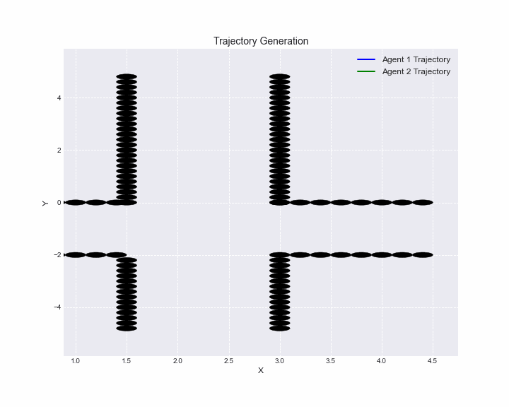
</td>
<td align="center" valign="center" bgcolor="#FFFFFF" width="33%">
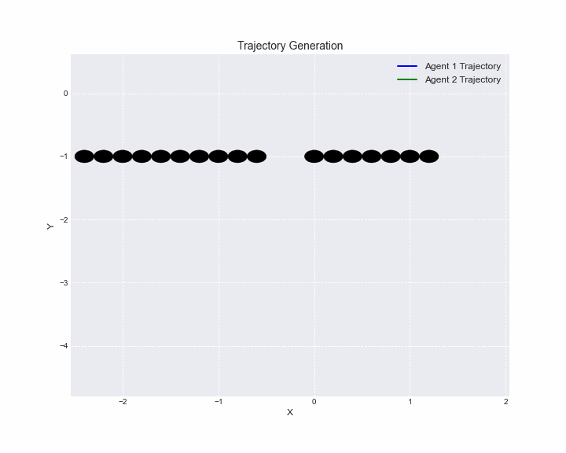
</td>
<td align="center" valign="center" style="background-color:rgba(0, 0, 0, 0);" width="33%">

</td>
<tr>
<td align="center" valign="center" style="background-color:rgba(0, 0, 0, 0);">

</td>
<td align="center" valign="center" style="background-color:rgba(0, 0, 0, 0);">

</td>
<td align="center" valign="center" style="background-color:rgba(0, 0, 0, 0);">

</td>
</tr>
<tr>
<td align="center" valign="center" bgcolor="#FFFFFF">
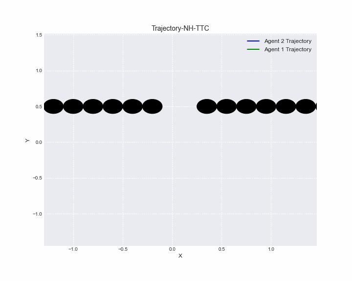
</td>
<td align="center" valign="center" bgcolor="#FFFFFF">
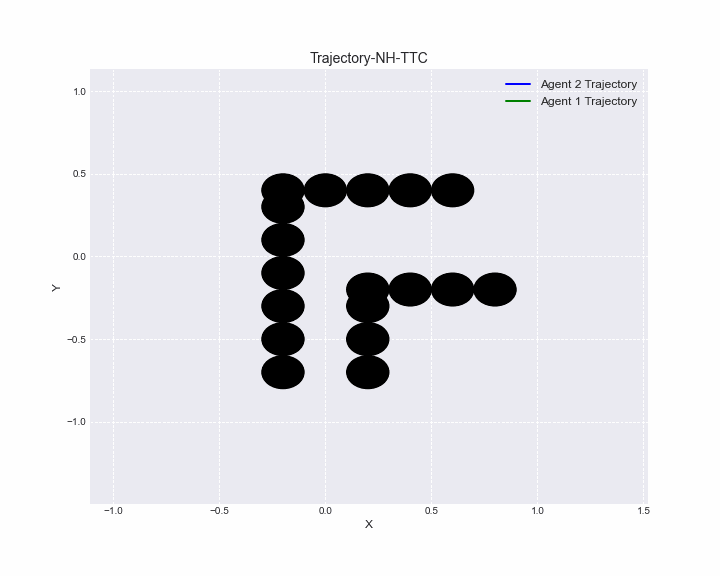
</td>
<td align="center" valign="center" bgcolor="#FFFFFF">
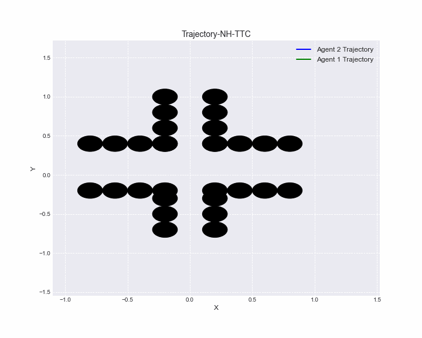
</td>
</tr>
</table>

# Table of Contents
- [**About**](#About)
- [**Dependcies**](#Dependcies)
- [**Overview**](#Overview)
- [**Installation**](#Installation)
- [**Evaluation**](#Evaluation)
- [**Supported Scenarios**](#Supported-Scenarios)
- [**Code Example**](#Code-Example)
- [**Success Metrics**](#Success-Metrics)


# Dependencies
* Matlab         2014b
* Python         3.6
* gym            0.26.2
* PyQt5          5.15.1
* opencv-python  4.1.2.30
* numpy          1.19.2
* mosek          9.4.20
* cvxpy          1.1.6
* scipy          1.5.3
* matplotlib     3.4.3
* cmake          3.10
* make
* OpenMP


# Installation

To run the experiments first clone the repository for installation

``` git clone https://github.com/abj247/Multi-agent-Motion-Planning-with-Deadlock-Resolution.git ```

Install the packages

```pip install -r requirements.txt```

# Evaluation 

To evaluate the experiments and visualize the trajectories run the evaluation script

```
python evaluate.py --path_deviation_csv path_deviation_file.csv --avg_delta_velocity_csv avg_delta_velocity_file.csv --evaluate_path_deviation --evaluate_avg_delta_velocity --save_path_deviation_plot --method method_name --scenario scenario_name
```


# Supporterd Scenarios
Our repository covers a wide spectrum of social navigation scenarios, including but not limited to:

* Doorway 
* Hallway 
* Intersection 
* L-Corner 
* Blind Corner 
* Crowded Traffic 
* Parallel Traffic 
* Perpendicular Traffic  
* Circular Traffic
  

<table style="border: none; border-collapse: collapse;" border="0" cellspacing="0" cellpadding="0" width="100%" align="center">
<tr>
<td align="center" valign="center" style="background-color:rgba(0, 0, 0, 0);" width="33%">
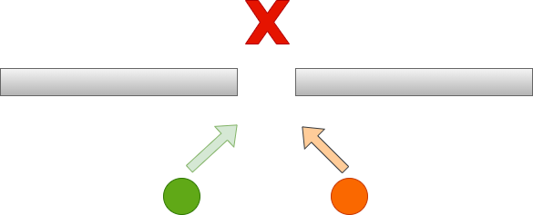
</td>
<td align="center" valign="center" bgcolor="#FFFFFF" width="33%">

</td>
<td align="center" valign="center" style="background-color:rgba(0, 0, 0, 0);" width="33%">
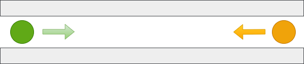
</td>
<tr>
<td align="center" valign="center" style="background-color:rgba(0, 0, 0, 0);">
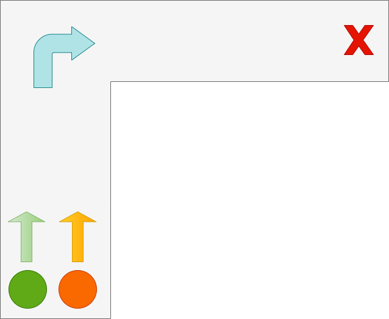
</td>
<td align="center" valign="center" style="background-color:rgba(0, 0, 0, 0);">
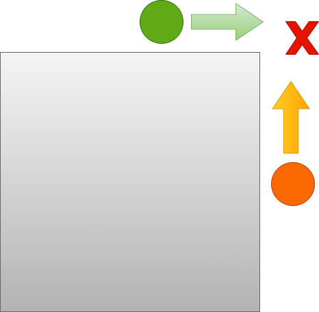
</td>
<td align="center" valign="center" style="background-color:rgba(0, 0, 0, 0);">
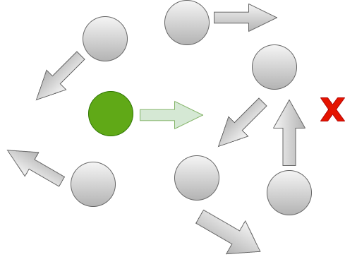
</td>
</tr>
<tr>
<td align="center" valign="center" bgcolor="#FFFFFF">
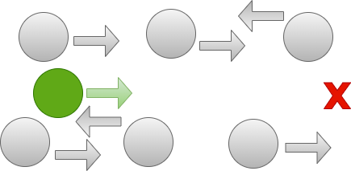
</td>
<td align="center" valign="center" bgcolor="#FFFFFF">
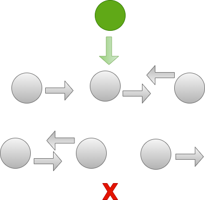
</td>
<td align="center" valign="center" bgcolor="#FFFFFF">

</td>
</tr>
</table>


# Code Example

This is the elementary code example on how to genetate the trajectory animation for L-Corner scenario for CADRL.

```python
import pandas as pd
import numpy as np
import matplotlib.pyplot as plt
import matplotlib.animation as animation
from scipy.spatial.distance import directed_hausdorff

data = pd.read_csv('Lcorner_cadrl.csv')

# Extract actual and nominal trajectory coordinates
agent_1_x = data.iloc[:, 0]
agent_2_x = data.iloc[:, 2]
agent_1_y = data.iloc[:, 1]
agent_2_y = data.iloc[:, 3]

# Compute trajectory difference
diff_x = agent_1_x - agent_2_x
diff_y = actual_1_y - agent_2_y


# Calculate Hausdorff distance
agent_1_trajectory = np.column_stack((agent_1_x, agent_1_y))
agent_2_trajectory = np.column_stack((agent_2_x, agent_2_y))
hausdorff_dist = directed_hausdorff(agent_1_trajectory, agent_2_trajectory)[0]


fig, ax = plt.subplots(figsize=(10, 8))
plt.style.use('seaborn-darkgrid')

ax.set_xlim(min(min(agent_1_x), min(agent_2_x)) - 1, max(max(agent_1_x), max(agent_2_x)) + 1)
ax.set_ylim(min(min(agent_1_y), min(agent_2_y)) - 1, max(max(agent_1_y), max(agent_2_y)) + 1)

# Set Obstacles Positions

circles = [(-1.0, -1.0, 0.1), (-1.2, -1.0, 0.1), (-1.4, -1.0, 0.1), (-0.8, -1.0, 0.1), (-0.6, -1.0, 0.1), (0.0, -1.0, 0.1), (0.2, -1.0, 0.1), (0.4, -1.0, 0.1), (0.6, -1.0, 0.1), (0.8, -1.0, 0.1), (1.0, -1.0, 0.1), (1.2, -1.0, 0.1), (-1.6, -1.0, 0.1), (-1.8, -1.0, 0.1), (-2.0, -1.0, 0.1), (-2.2, -1.0, 0.1), (-2.4, -1.0, 0.1)]  # Replace with your circle positions and sizes
for x, y, radius in circles:
    circle = plt.Circle((x, y), radius, color='black', fill=True)
    ax.add_artist(circle)

agent_1_traj_line, = ax.plot([], [], linestyle='-', linewidth=2, color='blue', label='Agent 1 Trajectory')
agent_2_traj_line, = ax.plot([], [], linestyle='-', linewidth=2, color='green', label='Agent 2 Trajectory')

# Set labels, title, and legend
ax.set_xlabel('X', fontsize=12)
ax.set_ylabel('Y', fontsize=12)
ax.set_title('Trajectory Generation', fontsize=14)
ax.legend(fontsize=12)
ax.grid(True, linestyle='--', alpha=0.7)

# Function to update the animation
def update(num, agent_1_x, agent_1_y, agent_2_x, agent_2_y):
    agent_1_traj_line.set_data(agent_1_x[:num], agent_1_y[:num])
    nominal_traj_line.set_data(agent_2_x[:num], agent_2_y[:num])
    return agent_1_traj_line, agent_2_traj_line

# Creating the animation
ani = animation.FuncAnimation(fig, update, frames=len(agent_1_x), fargs=(agent_1_x, agent_1_y, agent_2_x, agent_2_y), blit=True)

# Save the animation as a GIF
gif_path = "./vis/CADRL/lcor.gif"  
ani.save(gif_path, fps=10)
```
<p align="center">

</p>

# Success Metrics
 In the pursuit of excellence within multi-agent social navigation, evaluating the performance and effectiveness of algorithms and methodologies is paramount. To comprehensively assess the impact of our solutions, we employ a set of carefully selected success metrics. These metrics serve as vital benchmarks, offering insights into the efficacy of our approaches in diverse scenarios. The success metrics incorporated into our repository encompass a range of key parameters, each shedding light on a specific aspect of agent behavior and system performance. These metrics include:

- Average Delta Velocity: This metric is the average consecutive difference between linear velocities recorded by the agents over the whole time steps. This metric is crucial in assessing how consistently the agents move and adapt their speeds while executing their assigned tasks to reach the goal position.

- Path Difference: This metric is the hausdorff distance between the nominal and actual trajectory covered by the agent. Here nominal is referred to the trajectory taken by the respective agent if it is present alone in the environment. Thsi metric helps us in evaluating the increased cost in path deviation against avoding the potential deadlock.

- Makespan Ratio: This is the ratio between the time taken by the last agent and the first agent to reach the goal position. Through this metric helps us in evaluating the time complexity for the method in deadlock and collision avoidance.

- Success Rate: This metric helps in determining the success of the method in deadlock avoidance, This is evaluated by taking the ratio of the number of times the agent successfully reached the goal position navigating safely to the total number of trials.

By integrating these success metrics into our repository, we aim to provide a holistic view of our algorithms' performance and their suitability for addressing the challenges of multi-agent social navigation. These metrics empower us to continually refine and enhance our methodologies, ultimately contributing to safer and more efficient interactions between agents in shared spaces.


